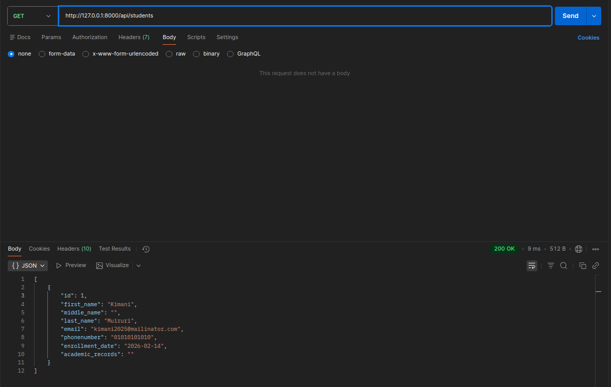
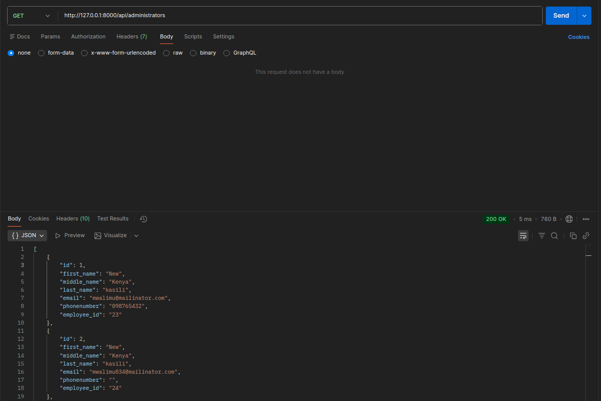
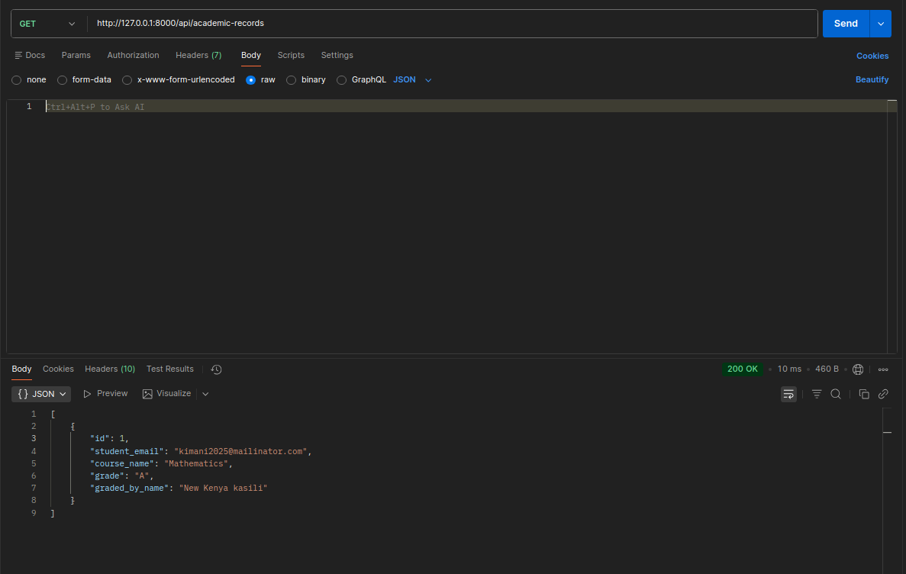

# Academic Records API

A Django REST Framework API for managing student grades with administrator oversight.

## Quick Start

```bash
# Setup
mkdir ShuleDigitali

cd ShuleDigitali

python -m venv venv
source venv/bin/activate 

git clone https://github.com/Kimani-Dominic/Shule

pip install django djangorestframework

python manage.py makemigrations students administrators academicRecords
python manage.py migrate
python manage.py createsuperuser
python manage.py runserver
```

Visit `http://127.0.0.1:8000/`

## API Endpoints

| Endpoint | Method | Description |
|----------|--------|-------------|
| `/api/students/` | GET | List all students |
| `/api/students/` | POST | Create student |
| `/api/students/<id>/` | GET | Get student |
| `/api/students/<id>/` | PUT | Update student |
| `/api/students/<id>/` | DELETE | Delete student |
| `/api/administrators/` | GET | List all admins |
| `/api/administrators/` | POST | Create admin |
| `/api/academic-records/` | GET | List all records |
| `/api/academic-records/` | POST | Create record |
| `/api/academic-records/<id>/` | GET | Get record |
| `/api/academic-records/<id>/` | PUT | Update record |
| `/api/academic-records/<id>/` | DELETE | Delete record |
| `/api-admin/` | GET | Login for browsable API |

## Example Usage

### Create Student
```bash
curl -X POST http://127.0.0.1:8000/api/students/ \
  -H "Content-Type: application/json" \
  -d '{"first_name":"John","last_name":"Doe","email":"john@example.com"}'
```

### Add Grade
```bash
curl -X POST http://127.0.0.1:8000/api/academic-records/ \
  -H "Content-Type: application/json" \
  -d '{"student":1,"course_name":"Math","grade":"A","graded_by":1}'
```

## Data Models

**Student**
```json
{
  "first_name": "Kimani",
  "last_name": "Muiruri",
  "email": "kimani@example.com",
  "full_name": "Kimani Muiruri"
}
```




**Administrators**
```json
{
  "first_name": "New",
  "last_name": "Kasili",
  "email": "kasili@example.com",
  "full_name": "Kasili Kenya"
}
```




**Academic Record**
```json
{
  "id": 1,
  "student_name": "Kimani Muiruri",
  "course_name": "Mathematics",
  "grade": "A",
  "graded_by_name": "Jane Smith"
}
```




## Testing

```bash
# Run tests
python manage.py test

# Test in shell
python manage.py shell
>>> from django.test import Client
>>> Client().get('/api/students/').json()
```

## Common Issues

| Problem | Solution |
|---------|----------|
| `"student": ["This field is required."]` | Use student ID: `{"student": 1}` |
| 301 redirects on PUT | Add trailing slash: `/api/records/1/` |


## Project Structure

```
├── students/          # Student models/views
├── administrators/    # Admin models/views  
├── academicRecords/   # Grade models/views
└── manage.py
```
